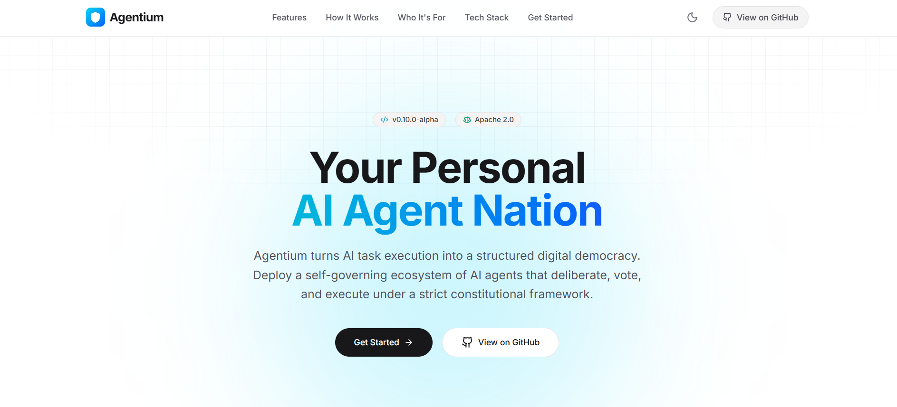

# Agentium

Agentium is a modern, responsive landing page for an AI automation platform, built with React, Vite, and Tailwind CSS.

**🔗 Live Site:** [https://agentium-site.vercel.app/](https://agentium-site.vercel.app/)



## Deploy to Vercel

This project is fully configured to be deployed on Vercel out-of-the-box. The repository includes a `vercel.json` file which handles proper routing for single-page applications.

[](https://vercel.com/new/clone?repository-url=https%3A%2F%2Fgithub.com%2FAshminDhungana%2FAgentium)

### Manual Deployment

1. Push your code to a GitHub, GitLab, or Bitbucket repository.
2. Import your repository into your Vercel dashboard.
3. Vercel will automatically detect the **Vite** framework.
4. Click **Deploy**.

## Local Development (Frontend Only)

To run this frontend project locally without Docker:

```bash
npm install
npm run dev
```

To build for production:

```bash
npm run build
```

---

*Licensed under the [Apache 2.0 License](https://www.apache.org/licenses/LICENSE-2.0)*